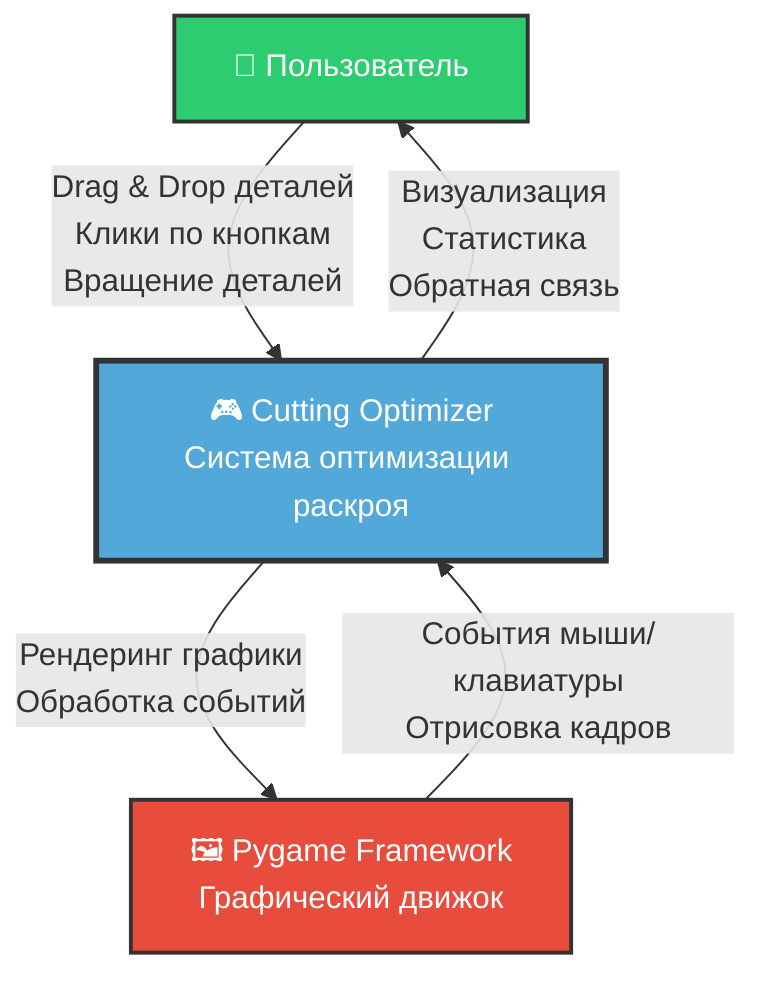
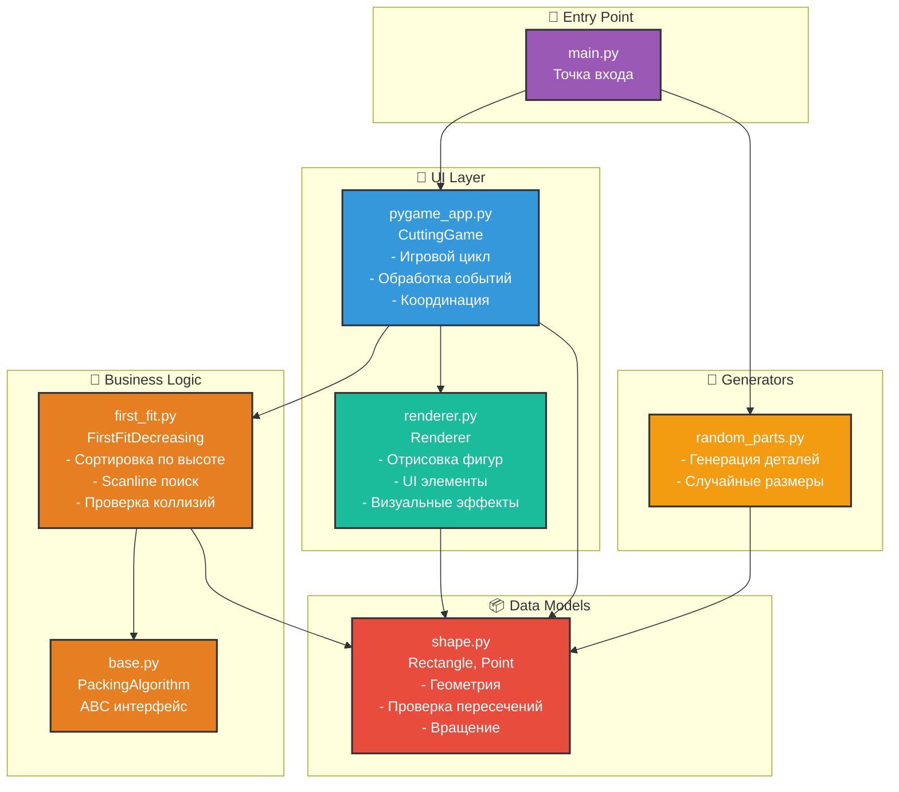
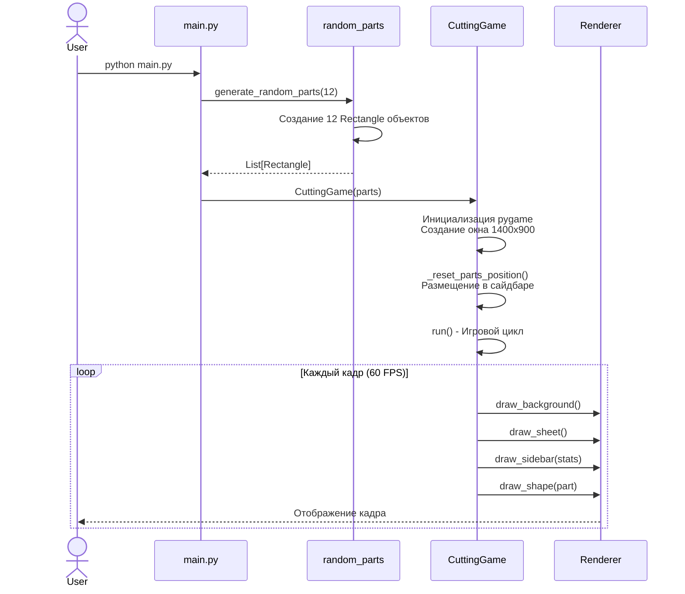
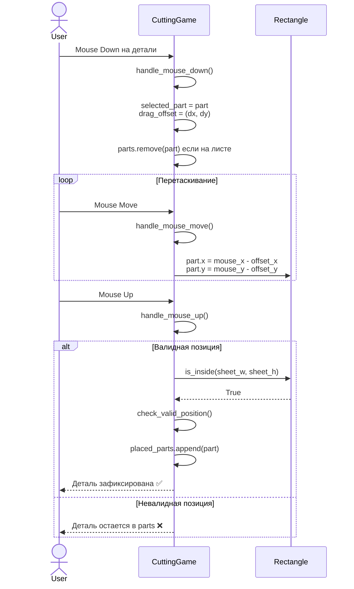
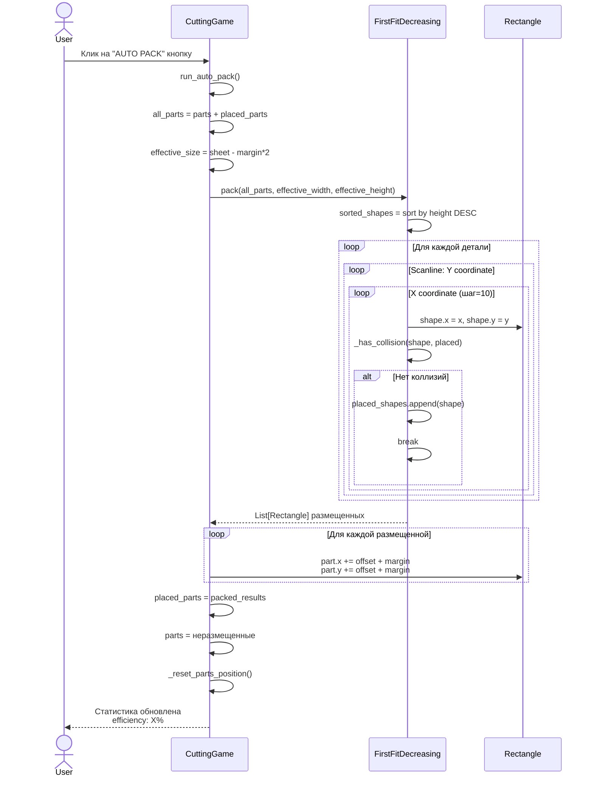
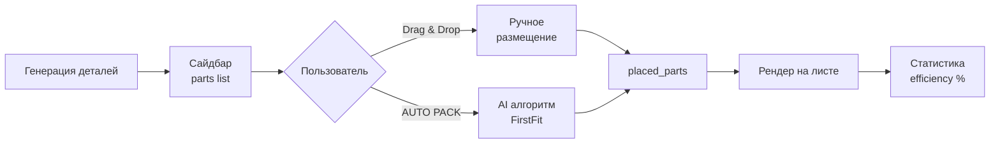

# Архитектура проекта Cutting-Optimizer

## System Context Diagram

Диаграмма показывает взаимодействие системы с внешними акторами.

---

## Component Diagram

Внутренняя структура приложения с разделением на модули.

---

## Sequence Diagram

Основные потоки данных в системе.

### Поток 1: Запуск приложения

### Поток 2: Ручное размещение детали

### Поток 3: Автоматическая упаковка (AI)

---

## Ключевые компоненты

### CuttingGame (pygame_app.py)
**Ответственность:**
- Главный игровой цикл (60 FPS)
- Обработка событий мыши и клавиатуры
- Управление состоянием деталей (parts / placed_parts)
- Расчет эффективности использования листа
- Интеграция с AI упаковщиком

**Основные методы:**
- `run()` - главный цикл
- `handle_mouse_down/up/move()` - drag & drop логика
- `run_auto_pack()` - запуск AI алгоритма
- `calculate_efficiency()` - метрики использования

### FirstFitDecreasing (first_fit.py)
**Алгоритм:**
1. Сортировка деталей по высоте (DESC)
2. Scanline поиск: перебор координат с шагом `step`
3. Проверка пересечений через AABB collision
4. Жадное размещение: первая подходящая позиция

**Параметры:**
- `step=10` - баланс скорости/качества (1=точно, 20=быстро)

### Rectangle (shape.py)
**Данные:**
- Размеры: `width`, `height`
- Позиция: `x`, `y`
- Идентификация: `id`, `color`

**Операции:**
- `intersects(other)` - проверка AABB пересечения
- `is_inside(sheet_w, sheet_h)` - проверка границ
- `rotate()` - поворот на 90°
- `area` - вычисление площади

### Renderer (renderer.py)
**Функции:**
- Отрисовка листа с сеткой и тенями
- Рендеринг деталей с подсветкой и валидацией
- Сайдбар со статистикой
- Кнопка "AUTO PACK" с hover эффектом
- Размерные аннотации

---

## Потоки данных

## Технологический стек

- **Python 3.12.7**
- **Pygame** - графический движок и обработка событий
- **Dataclasses** - модели данных
- **ABC (Abstract Base Classes)** - интерфейсы алгоритмов

## Метрики производительности

- **FPS:** 60 кадров/сек
- **Разрешение:** 1400x900 пикселей
- **Размер листа:** 800x600 мм
- **Шаг алгоритма:** 10 пикселей (настраиваемый)
- **Margin:** 4 мм между деталями
